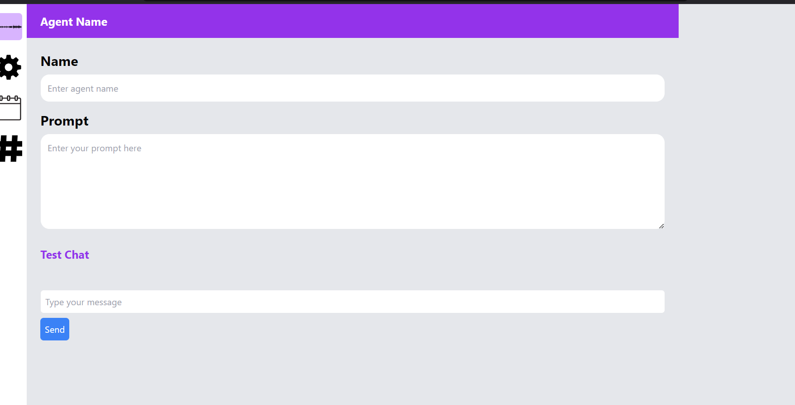
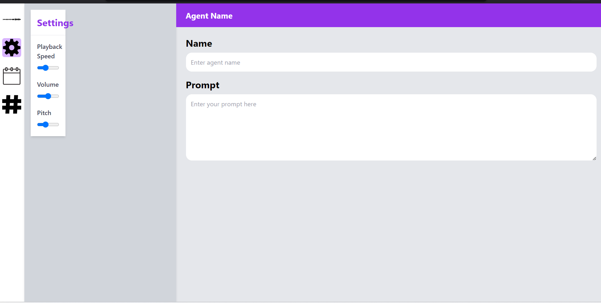
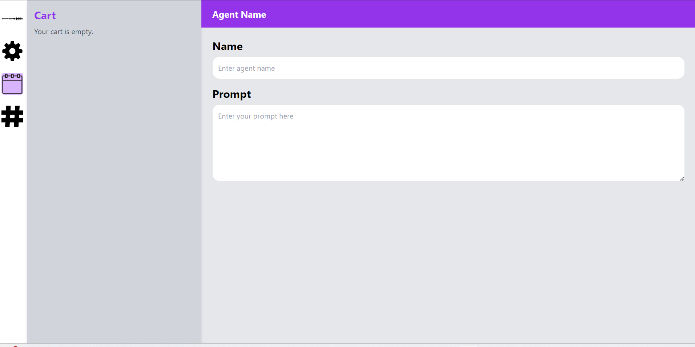

### **README.md**

```markdown
# Agent Management System

This project is an agent management system built using React. It provides a sidebar for easy navigation, allowing users to manage agent details, test chat functionality, and access settings.

## Features

- **Sidebar Navigation**: A simple sidebar with icons for different options like "Select Voice", "Settings", "Cart", and "Other".
- **Agent Details**: Allows the user to set an agent's name and prompt.
- **Test Chat**: Enables a test chat interface where the user can send messages.
- **Responsive Design**: The application is fully responsive and adapts to different screen sizes.

## Installation

### Prerequisites

1. **Node.js**: Ensure that you have Node.js installed. You can check by running the following command in your terminal:
   ```bash
   node -v
   ```
   If it's not installed, you can download it from [here](https://nodejs.org/).

2. **Clone the repository**:
   ```bash
   git clone https://github.com/your-username/agent-management-system.git
   cd agent-management-system
   ```

3. **Install dependencies**:
   Inside the project directory, run the following command to install the required dependencies:
   ```bash
   npm install
   ```

4. **Run the project**:
   After the dependencies are installed, you can start the development server by running:
   ```bash
   npm start
   ```

   This will start the application on `http://localhost:3000`.

## Project Structure

```
/src
  |-- /components
    |-- AgentList.js           # Sidebar component
    |-- AgentDetails.js        # Main content for agent details and chat
  |-- App.js                   # Main App component integrating everything
  |-- /assets                  # SVG icons and assets
    |-- Sound-Wave.svg         # Sound wave logo
    |-- icons8-settings.svg    # Settings icon
    |-- reshot-icon-calendar-RTYJNSX56M.svg # Calendar icon
    |-- svgviewer-output.svg   # Other icon
```

## Screenshots

### 1. **Initial Screen with Sidebar**  
This is the initial screen with the sidebar displaying the different options (Select Voice, Settings, Cart, and Other).


### 2. **Agent Details and Test Chat**  
Once an option is selected from the sidebar, the main content shows the agent details section, including the name, prompt, and test chat feature.



### 3. **settings page**

]

### 4. **cart**


## Usage

1. **Select Voice**: Click on the voice option in the sidebar to configure the voice agent.
2. **Settings**: Customize the agent settings from the settings option in the sidebar.
3. **Cart**: The cart option is provided for additional management features in the future.
4. **Other**: The 'Other' option serves as a placeholder for any additional features.

## Technologies Used

- **React.js**: For building the user interface and managing components.
- **Tailwind CSS**: For styling the application with a utility-first approach.
- **LocalStorage**: To store and persist the agent name and prompt.

## License

This project is licensed under the MIT License - see the [LICENSE](LICENSE) file for details.

## Acknowledgements

- **React**: The framework used to build the user interface.
- **Tailwind CSS**: The utility-first CSS framework used for styling.

## Contact

For any questions or inquiries, feel free to contact me at:
- Email: your-email@example.com
- GitHub: [https://github.com/your-username](https://github.com/your-username)
```

### Steps to Add Output Images:

1. **Run the Project**: Open the project in your browser (after running `npm start`), and take screenshots of the relevant sections (initial screen, agent details, and chat).
2. **Save Screenshots**: Save these images in the `assets` folder of your project. For example, save the sidebar screenshot as `sidebar.png` and the agent details as `agent-details.png`.
3. **Update the README**: The image file paths are already set in the README. Just make sure to place the actual images in the `assets` folder.


